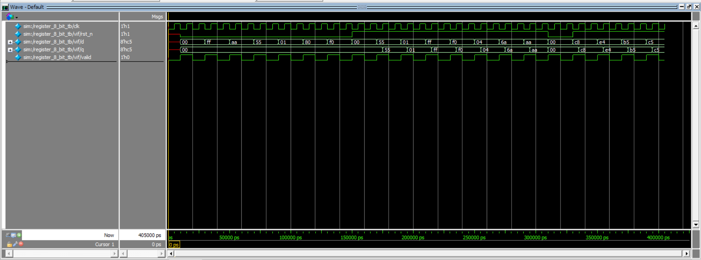

# Project 3 — UVM-Based 8-bit Register Verification

## Overview

This project verifies an 8-bit synchronous register with an active-low asynchronous reset using **SystemVerilog and UVM**.

The project is the third stage of the verification progression:

1. Procedural SystemVerilog DV
2. Class-Based SystemVerilog DV
3. UVM-Based DV

The goal is to demonstrate a reusable, layered UVM verification environment with constrained-random stimulus, functional coverage, assertions, a predictor/reference model, and a scoreboard.

---

## DUT

The DUT is an 8-bit register with:

- Synchronous data capture
- Active-low asynchronous reset
- Reset value: `8'h00`

### Interface

| Signal | Width | Description |
|---|---:|---|
| `clk` | 1 | Clock |
| `rst_n` | 1 | Active-low asynchronous reset |
| `d` | 8 | Data input |
| `q` | 8 | Registered output |

---

## UVM Architecture

```text
                    UVM TEST
                       |
                  UVM SEQUENCE
                       |
                   SEQUENCER
                       |
                    DRIVER
                       |
                Virtual Interface
                       |
                      DUT
                       |
                    MONITOR
                       |
             +---------+---------+
             |                   |
          COVERAGE           PREDICTOR
                                 |
                           EXPECTED DATA
                                 |
                            SCOREBOARD
                                 |
                         PASS / FAIL REPORT
---

## Simulation Evidence

### QuestaSim Waveform

The waveform below shows the main DUT and testbench signals during simulation:

- `clk`
- `rst_n`
- `d`
- `q`
- `valid`



### QuestaSim Coverage Report

The functional coverage report generated by QuestaSim is available here:

[View Coverage Report](results/coverage_report.txt)

- **100% functional coverage**
- **27/27 coverage bins covered**
